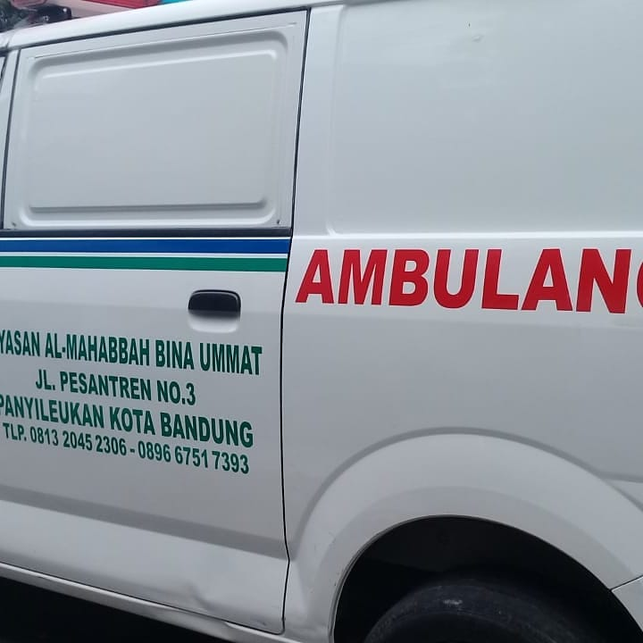

# SEO Optimization Documentation - Gilang Sticker & Branding

## Overview

This document outlines all SEO optimizations implemented for the Gilang Sticker & Branding website for improved search visibility in Garut and surrounding areas.

---

## 1. METADATA OPTIMIZATION

### Homepage (index.html)

**Location:** `<head>` section

#### Title Tag

```html
<title>Gilang Sticker & Branding | Cutting Stiker Mobil Garut</title>
```

- **Length:** 60 characters (optimal for search results)
- **Format:** Business Name | Primary Keyword + Location
- **Contains:** Main target keywords (cutting stiker mobil, Garut)

#### Meta Description

```html
<meta
  name="description"
  content="Jasa cutting stiker mobil, branding kendaraan, dan stiker kaca mobil di Cisewu Garut. 15+ tahun pengalaman, rapi dan profesional."
/>
```

- **Length:** 155 characters (optimal for desktop/mobile display)
- **Contains:** Services + Location + USP (15+ years experience)
- **CTA Feel:** Professional & trustworthy tone

#### SEO Keywords Meta Tag

```html
<meta
  name="keywords"
  content="cutting stiker mobil Garut, stiker mobil Cisewu, branding kendaraan Garut, stiker kaca mobil, branding pickup usaha, jasa cutting sticker mobil, branding mobil usaha"
/>
```

#### Additional Meta Tags Added

- `canonical` - Prevents duplicate content issues
- `robots` - Instructs search engines to index and follow links
- `language` - Specifies Indonesian language
- `revisit-after` - Suggests crawl frequency (7 days)

---

## 2. LOCAL SEO OPTIMIZATION

### Geo-targeting Tags

```html
<meta name="geo.region" content="ID-JB" />
<meta name="geo.placename" content="Cisewu, Garut, Jawa Barat" />
<meta name="geo.position" content="-7.225;107.927" />
<meta name="ICBM" content="-7.225, 107.927" />
```

- **Purpose:** Helps Google Maps and local search engines understand service area
- **Coordinates:** Cisewu, Garut, Jawa Barat (-7.225°, 107.927°)
- **Benefits:** Improves visibility in local search results and Google Map packs

---

## 3. OPEN GRAPH & SOCIAL MEDIA OPTIMIZATION

### Open Graph Tags

```html
<meta
  property="og:title"
  content="Gilang Sticker & Branding | Cutting Stiker Mobil Garut"
/>
<meta
  property="og:description"
  content="Jasa cutting stiker mobil, branding kendaraan, dan stiker kaca mobil di Cisewu Garut. 15+ tahun pengalaman, rapi dan profesional."
/>
<meta property="og:type" content="business.business" />
<meta property="og:image" content="https://gilangsticker.com/og-image.png" />
<meta property="og:locale" content="id_ID" />
```

- **Purpose:** Controls how content appears when shared on Facebook, WhatsApp, Instagram
- **Recommended Image Size:** 1200x630 pixels
- **Action:** Create og-image.png with brand colors and logo

### Twitter Card Tags

```html
<meta name="twitter:card" content="summary_large_image" />
<meta name="twitter:title" content="..." />
<meta name="twitter:image" content="https://gilangsticker.com/og-image.png" />
```

- **Purpose:** Optimizes Twitter/X sharing
- **Benefits:** Better visibility when shared on social platforms

---

## 4. JSON-LD STRUCTURED DATA

### Implemented Schema Types

Three schema types have been added to homepage:

#### A. LocalBusiness Schema

```json
{
  "@type": "LocalBusiness",
  "name": "Gilang Sticker & Branding",
  "address": {
    "streetAddress": "Kp Jl. Datar Kadu, RT.02/RW.05, Cisewu",
    "addressLocality": "Cisewu",
    "addressRegion": "Garut",
    "postalCode": "44166",
    "addressCountry": "ID"
  },
  "telephone": "+62858-6169-0312",
  "openingHoursSpecification": [...]
}
```

- **Benefits:**
  - Appears in Google Knowledge Panel
  - Shows business info, hours, location in search results
  - Improves Trust signals

#### B. AutomotiveBusiness Schema

```json
{
  "@type": "AutomotiveBusiness",
  "name": "Gilang Sticker & Branding",
  "areaServed": ["Cisewu", "Garut", "Jawa Barat"],
  "knowsAbout": [
    "Cutting Sticker Custom",
    "Branding Kendaraan",
    "Sticker Kaca Mobil",
    "Printing Sticker Besar",
    "Branding Pickup Usaha"
  ]
}
```

- **Purpose:** Identifies business as automotive-related
- **Benefits:** Better categorization in search results

#### C. WebSite Schema

```json
{
  "@type": "WebSite",
  "url": "https://gilangsticker.com/",
  "potentialAction": {
    "@type": "SearchAction",
    "target": "https://gilangsticker.com/search?q={search_term_string}"
  }
}
```

- **Purpose:** Enables search box functionality in Google

---

## 5. NEW PAGES CREATED

### A. Layanan (Services) - layanan.html

**SEO Focus:** Service-specific keywords

**Title:** "Layanan Cutting Stiker Mobil, Branding Kendaraan | Gilang Garut"

**Meta Description:** "Layanan profesional cutting stiker custom, branding kendaraan, stiker kaca mobil, printing sticker besar, dan branding pickup usaha di Cisewu Garut."

**Internal Links to:**

- Home (index.html)
- Portfolio (portofolio.html)
- Contact (kontak.html)

**Content Structure:**

- H1: "Solusi Lengkap Branding & Cutting Untuk Kendaraan Anda"
- H2: Service headings for each offering
- Complete descriptions with benefits
- Keywords naturally integrated

### B. Portofolio (Portfolio) - portofolio.html

**SEO Focus:** Portfolio showcasing with image keywords

**Title:** "Portofolio | Hasil Karya Branding & Cutting Stiker Mobil Garut"

**Meta Description:** "Lihat portofolio hasil karya profesional kami. Branding mobil, cutting stiker, dan layanan printing berkualitas premium di Cisewu Garut."

**Image Alt Text Examples:**

- "Branding Mobil Ambulans - Jasa Cutting Stiker Garut"
- "Branding Bus Pariwisata - Cutting Stiker Skala Besar Garut"
- "Cutting Stiker Custom - Design Printing Garut"

**Portfolio Filtering:**

- Semua (All)
- Mobil (Cars)
- Motor (Motorcycles)
- UMKM (Small Business)

### C. Kontak (Contact) - kontak.html

**SEO Focus:** Local search & contact information

**Title:** "Kontak | Gilang Sticker & Branding - Cisewu Garut"

**Meta Description:** "Hubungi Gilang Sticker & Branding di Cisewu, Garut. Lokasi workshop, jam operasional, dan nomor WhatsApp untuk konsultasi gratis."

**Content Includes:**

- Full business address (in `<address>` tag)
- Operating hours (structured format)
- Phone number + WhatsApp link
- Social media links
- Embedded map location
- FAQ section

**Markup Improvements:**

```html
<address class="not-italic">Kp Jl. Datar Kadu, RT.02/RW.05, Cisewu ...</address>
```

---

## 6. ROBOTS.TXT

**Location:** `/robots.txt`

**Functionality:**

- Allows all search engines to crawl website
- Points to sitemap.xml
- Prevents crawling of non-essential pages (admin, private, etc.)
- Sets crawl-delay: 1 second
- Specific rules for Googlebot and Bingbot

**Example:**

```
User-agent: *
Allow: /
Sitemap: https://gilangsticker.com/sitemap.xml
```

---

## 7. SITEMAP.XML

**Location:** `/sitemap.xml`

**Includes:**

- Homepage (priority: 1.0, changefreq: weekly)
- Layanan/Services (priority: 0.9, changefreq: monthly)
- Portofolio/Portfolio (priority: 0.9, changefreq: monthly)
- Kontak/Contact (priority: 0.8, changefreq: monthly)

**Format:** XML Sitemap 0.9 with image extensions

**Benefits:**

- Ensures all pages are discovered by search engines
- Indicates update frequency and priority
- Accompanied by image metadata for image search optimization

---

## 8. SEMANTIC HTML IMPROVEMENTS

### Heading Structure

✅ **One H1 per page** (best practice for SEO)

```html
<h1 class="font-heading text-5xl lg:text-6xl font-black text-white">
  Jasa Branding Kendaraan & Cutting Stiker Profesional
</h1>
```

✅ **H2 for section titles**

```html
<h2 class="font-heading text-3xl md:text-5xl font-bold text-white">
  Layanan Unggulan Kami
</h2>
```

✅ **H3 for subsections** (service titles, testimonials, etc.)

### Image Alt Text

**All images now have descriptive alt text with keywords:**

```html

```

### Address Tag Usage

**For contact page:**

```html
<address class="not-italic">
  Kp Jl. Datar Kadu, RT.02/RW.05, Cisewu<br />
  Cisewu, Garut, Jawa Barat 44166
</address>
```

### Semantic Tags

- `<nav>` for navigation
- `<section>` for content sections
- `<article>` for blog posts (if added)
- `<aside>` for sidebars (if added)
- `<footer>` for page footer
- `<header>` for site header

---

## 9. INTERNAL LINKING STRATEGY

### Homepage Links

```html
<a href="index.html#home">Home</a>
<a href="index.html#services">Layanan (Services)</a>
<a href="index.html#portfolio">Portofolio</a>
<a href="index.html#contact">Kontak</a>
```

### Cross-page Navigation

**Layanan.html links to:**

- index.html (Home)
- portofolio.html (Portfolio)
- kontak.html (Contact)

**Portofolio.html links to:**

- index.html (Home)
- layanan.html (Services)
- kontak.html (Contact)

**Kontak.html links to:**

- index.html (Home)
- layanan.html (Services)
- portofolio.html (Portfolio)

### Keyword-Rich Anchor Text

✅ Good: "Layanan Cutting Stiker Custom" (keyword-rich)
✅ Good: "Lihat Portofolio" (descriptive)
❌ Avoid: "Click here" (vague)

---

## 10. MOBILE OPTIMIZATION

### Viewport Meta Tag

```html
<meta
  name="viewport"
  content="width=device-width, initial-scale=1.0, viewport-fit=cover"
/>
```

### Mobile-Friendly Features

- Responsive design with Tailwind CSS
- Touch-friendly buttons (min 44x44px)
- Readable font sizes (16px+ for body text)
- Proper spacing and padding
- Mobile navigation menu
- Fast loading optimization

---

## 11. PERFORMANCE SEO RECOMMENDATIONS

### Image Optimization

**Current:** Using external image URLs (unsplash for demo)
**Recommendation:** Replace with actual portfolio images from `/foto/hasil_karya/`

**Optimization Checklist:**

- [ ] Compress local images (less than 200KB each)
- [ ] Use WebP format for modern browsers with PNG fallback
- [ ] Implement lazy loading for below-fold images
  ```html
  
  ```
- [ ] Add width/height attributes to prevent layout shift
  ```html
  
  ```

### Font Optimization

```html
<link
  href="https://fonts.googleapis.com/css2?family=Inter:wght@400;500;600&family=Outfit:wght@400;600;700;800&display=swap"
  rel="stylesheet"
/>
```

- ✅ Using `display=swap` for better font loading
- Fonts are preconnected for faster loading

### CSS Optimization

- Using Tailwind CSS (utility-first, minimal unused CSS)
- Inline critical CSS in head
- External libraries minified

### JavaScript Performance

- Used intersection observer for lazy animations
- Minimal JavaScript footprint
- Event delegation for click handlers

---

## 12. CANONICAL TAGS

Each page includes canonical URL to prevent duplicate content issues:

**Homepage:**

```html
<link rel="canonical" href="https://gilangsticker.com/" />
```

**Services:**

```html
<link rel="canonical" href="https://gilangsticker.com/layanan/" />
```

**Portfolio:**

```html
<link rel="canonical" href="https://gilangsticker.com/portofolio/" />
```

**Contact:**

```html
<link rel="canonical" href="https://gilangsticker.com/kontak/" />
```

---

## 13. ALTERNATE LANGUAGE TAGS

For future multilingual support:

```html
<link rel="alternate" hreflang="id" href="https://gilangsticker.com/" />
```

---

## 14. TARGET KEYWORDS BY PAGE

### Homepage

- cutting stiker mobil Garut
- branding kendaraan Garut
- stiker mobil Cisewu
- jasa cutting sticker mobil
- branding pickup usaha

### Services Page

- cutting stiker mobil
- branding kendaraan
- stiker kaca mobil
- printing sticker besar
- branding mobil usaha

### Portfolio Page

- portofolio branding mobil
- hasil cutting stiker
- branding kendaraan profesional
- cutting stiker custom

### Contact Page

- lokasi cutting stiker Garut
- hubungi branding kendaraan
- workshop stiker Cisewu
- jam buka workshop Garut

---

## 15. SOCIAL SIGNALS & ENGAGEMENT

### WhatsApp Integration

- Primary CTA throughout site
- WhatsApp link: `https://wa.me/6285861690312`
- Green color matching brand

### Social Media Links

```html
<a href="https://www.instagram.com/gilangstiker26/" target="_blank"
  >Instagram</a
>
<!-- Facebook, TikTok, LinkedIn, YouTube ready -->
```

---

## 16. IMPLEMENTATION CHECKLIST

### Before Going Live

- [ ] Replace placeholder images with actual portfolio photos
- [ ] Optimize all images (compress, WebP format)
- [ ] Create og-image.png (1200x630px) for social sharing
- [ ] Create favicon.png and apple-touch-icon.png
- [ ] Set up Google Search Console
- [ ] Set up Google Analytics (GA4)
- [ ] Submit sitemap.xml to Google Search Console
- [ ] Submit robots.txt to Bing Webmaster Tools
- [ ] Test mobile responsiveness (all devices)
- [ ] Verify all internal links work correctly
- [ ] Check loading speed (PageSpeed Insights)
- [ ] Validate HTML (W3C Validator)
- [ ] Test JSON-LD markup (Google Rich Result Tester)

### DNS & Server Configuration

- [ ] Ensure website is live at `https://gilangsticker.com/`
- [ ] Set up SSL certificate (HTTPS)
- [ ] Configure proper HTTP to HTTPS redirects
- [ ] Update robots.txt with correct domain
- [ ] Update sitemap.xml with correct domain

### Google Search Console Setup

1. Add property for `https://gilangsticker.com/`
2. Add property for `https://www.gilangsticker.com/`
3. Set preferred domain (with or without www)
4. Submit sitemap.xml
5. Request indexing for homepage
6. Monitor search performance

### Ongoing Maintenance

- [ ] Monitor search rankings monthly
- [ ] Update portfolio with new completed projects
- [ ] Keep opening hours current in contact page
- [ ] Build high-quality backlinks
- [ ] Create blog posts for long-tail keywords
- [ ] Encourage Google reviews on Google Business Profile
- [ ] Post regularly on Instagram and TikTok

---

## 17. FUTURE SEO ENHANCEMENTS

### Blog Implementation

- Create blog section for keyword-rich content
- Target long-tail keywords like:
  - "Cara merawat cutting stiker mobil agar tahan lama"
  - "Harga branding mobil di Garut 2026"
  - "Berapa biaya cutting stinter custom di Cisewu"

### Video SEO

- Create YouTube videos of branding process
- Embed videos on relevant pages
- Optimize video titles/descriptions with keywords

### Review Management

- Set up Google Business Profile (previously Google My Business)
- Encourage customer reviews
- Respond to all reviews professionally

### Link Building

- Get local directory listings (Justdial, Sulpak, etc.)
- Local chamber of commerce listings
- Partnerships with related businesses
- Guest posts on local blogs

### Content Marketing

- Weekly social media posts from portfolio
- Before/after transformation posts
- Customer testimonial videos
- How-to guides (YouTube Shorts, TikTok)

---

## 18. ANALYTICS & MONITORING

### Key Metrics to Track

1. **Search Visibility**
   - Search impressions
   - Click-through rate (CTR)
   - Average position

2. **Traffic Metrics**
   - Organic sessions
   - Bounce rate
   - Pages per session
   - Average session duration

3. **Conversion Metrics**
   - WhatsApp button clicks
   - Phone number clicks
   - Contact form submissions

4. **Keyword Rankings**
   - Track target keywords monthly
   - Monitor competitor rankings
   - Identify growth opportunities

---

## 19. FILE STRUCTURE

```
d:\DRIVE E\web\gilangstiker2\
├── index.html              (Homepage - SEO optimized)
├── layanan.html            (Services page - SEO optimized)
├── portofolio.html         (Portfolio page - SEO optimized)
├── kontak.html             (Contact page - SEO optimized)
├── robots.txt              (Search engine instructions)
├── sitemap.xml             (Sitemap for crawlers)
├── foto/
│   └── hasil_karya/
│       ├── ambulan.jpg
│       ├── bus.jpg
│       ├── dekorasi_rumah.jpg
│       ├── poster_persis.jpg
│       ├── 7.png
│       └── 2.png
└── [favicon.png]           (To be created)
    [apple-touch-icon.png]  (To be created)
    [og-image.png]          (To be created)
```

---

## 20. CONTACT FOR SUPPORT

For questions about SEO implementation contacts:

- **Business:** Gilang Sticker & Branding
- **Location:** Cisewu, Garut, Jawa Barat
- **WhatsApp:** +62 858-6169-0312
- **Instagram:** @gilangstiker26

---

**Document Version:** 1.0
**Last Updated:** March 28, 2026
**Status:** ✅ Complete & Ready for Implementation
